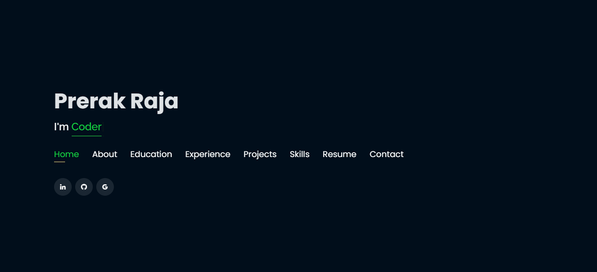
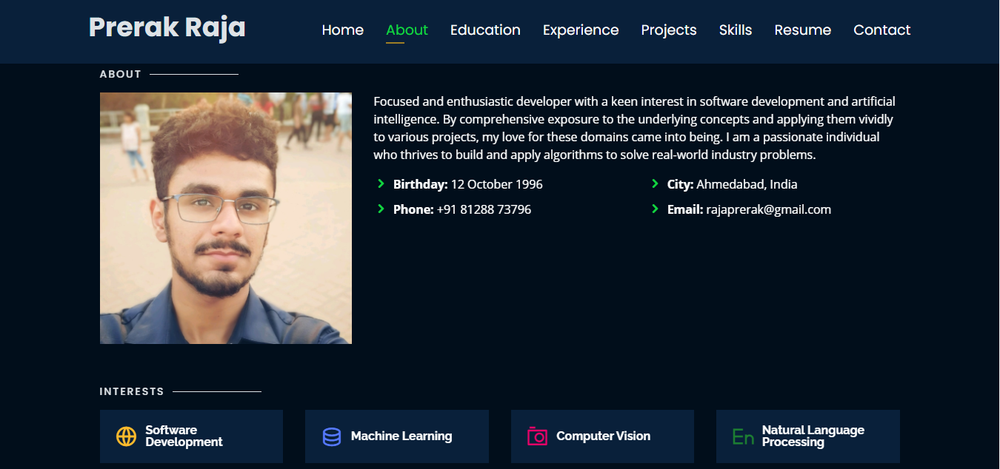
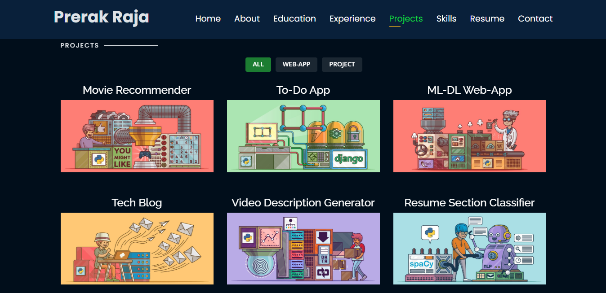

Personal Portfolio 🔥

https://daohuynh1999.github.io/

:star: Star me on GitHub — it helps!
Show Image
Show Image
Show Image
Show Image
Website Preview
Home Page

About Page

Projects Page

:star: Star me on GitHub — it helps!
Features 📋
⚡️ Fully Responsive
⚡️ Valid HTML5 & CSS3
⚡️ Typing animation using Typed.js
⚡️ Modern Front-End Development Projects
⚡️ Easy to modify
About Me 👨‍💻
Motivated software engineer skilled in Front-End Development with expertise in Java, JavaScript, HTML, CSS, and React. Passionate about building innovative web applications and tools. Currently developing a custom web browser project that integrates advanced data structures with modern front-end frameworks to deliver high-performance user experiences.
📍 Located in Frisco, TX
🎓 BS in Software Engineering at University of Texas at Dallas (Jan 2024 - Present)
💼 Seeking Frontend Development Internships
Installation & Deployment 📦

Clone the repository and modify the content of <b>index.html</b>
Add or remove images from assets/img/ directory as per your requirement.
Update the info of projects folder according to your need
Use Github Pages to create your own website.
To deploy your website, first you need to create github repository with name <your-github-username>.github.io and push the generated code to the master branch.

Sections 📚
✔️ About
✔️ Interests
✔️ Education
✔️ Online Certification (Meta Front-End Developer)
✔️ Projects
✔️ Resume
✔️ Contact Info
Projects 💻

E-Commerce Website - Full-featured online shopping platform
Quiz React App - Interactive quiz application built with React
To-Do List - Task management application
Weather App - Real-time weather information app
Calculator App - Functional calculator with modern UI

Technologies Used 🛠️

Frontend: HTML5, CSS3, JavaScript, React, TypeScript
Tools: Git, GitHub, Vite
Design: Bootstrap, Responsive Design
Hosting: GitHub Pages

Certifications 🏆

Meta Front-End Developer Professional Certificate

Introduction to Front-End Development
Programming with JavaScript
Version Control
HTML and CSS in depth
React Basics
Advanced React

Contact 📫

Email: daohuynh1999@gmail.com | dal239898@utdallas.edu
Phone: +1 205-482-7072
LinkedIn: David Huynh
GitHub: daohuynh1999

Contributing 💡
Step 1

Option 1

🍴 Fork this repo!

Option 2

👯 Clone this repo to your local machine.

Step 2

Build your code 🔨🔨🔨

Step 3

🔃 Create a new pull request.

License
Show Image

MIT license

⭐️ From David Huynh
